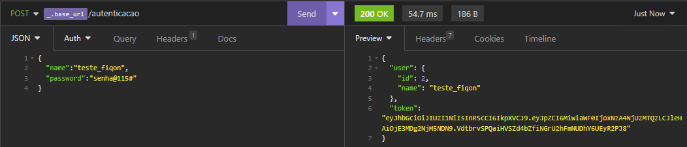
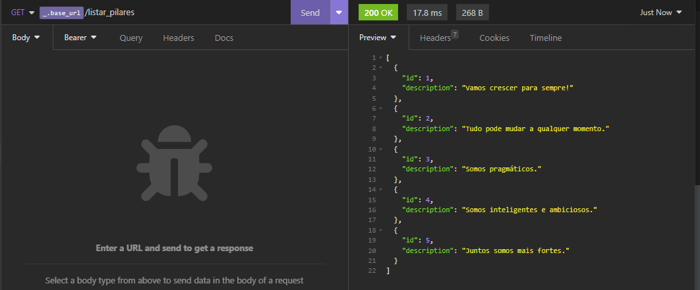
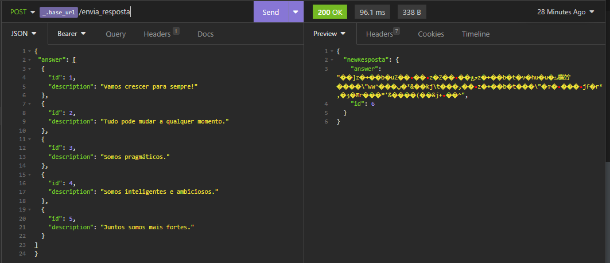

# Tech Interview FiqOn

Tecnologias:
> NodeJS + TypeScript + Express + TypeOrm + Nodemon
>> Banco de dados Postgres (Docker+DBeaver)
>>> Ferramenta para testes: Insomnia

<hr>

## Configurações Insomnia

manage Environments

````
{
	"base_url": "http://localhost:3333",
	"token": "TOKEN DE USUARIO"
}
````

<hr>

## Docker setup

````
 docker ps 
 docker rm <CONTAINER ID>
 docker run --name postgres -e POSTGRES_PASSWORD=docker 
 –p 5433:5432 -d postgres
````

<hr>

## Capturas de tela

<div style="width:90%;display: inline-block;" align="center">
    
    <p>Exemplo autenticação e retorno do Token</p>
</div>

<br>

<div style="width:90%;display: inline-block;" align="center">
    
    <p>Exemplo retorno das informações GET</p>
</div>

<br>

<div style="width:90%;display: inline-block;" align="center">
    
    <p>Exemplo Resposta final</p>
</div>